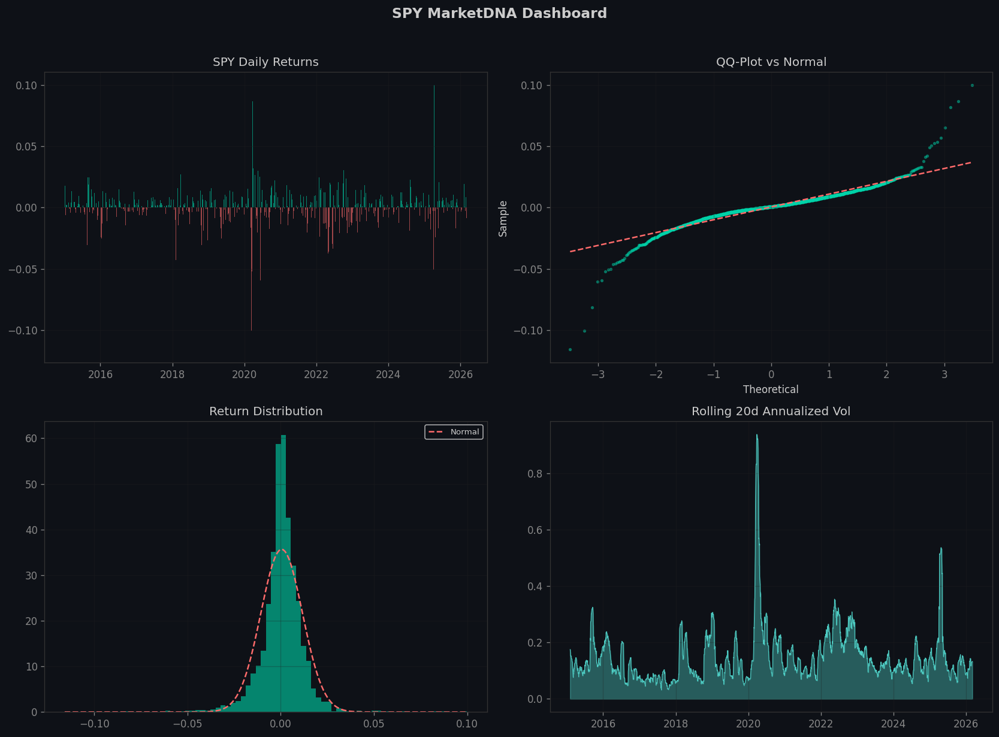
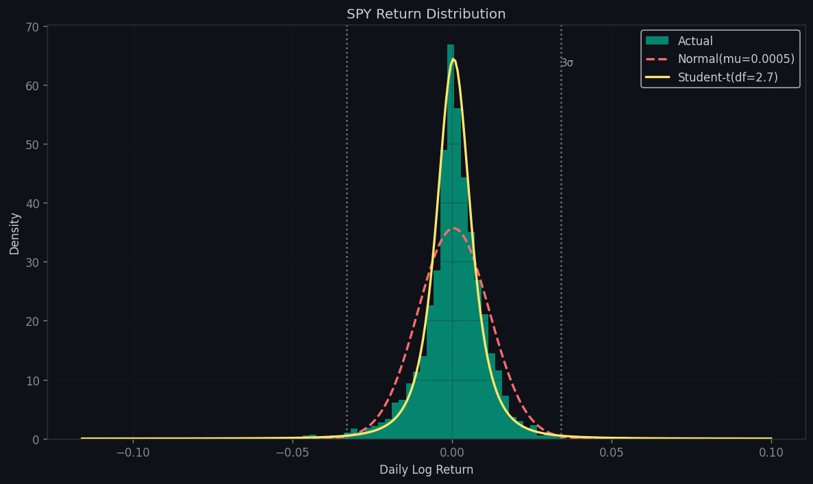
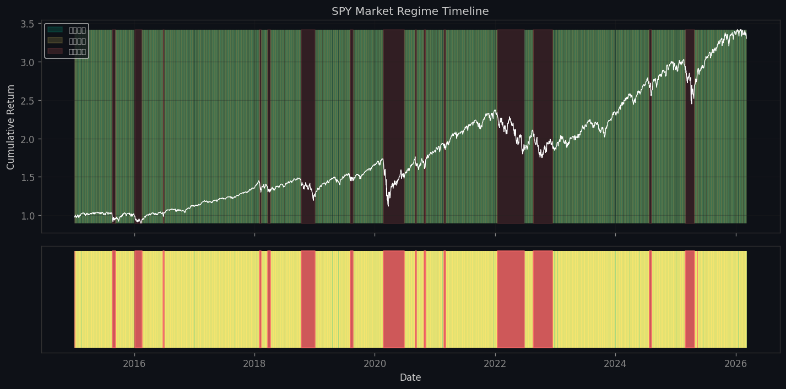
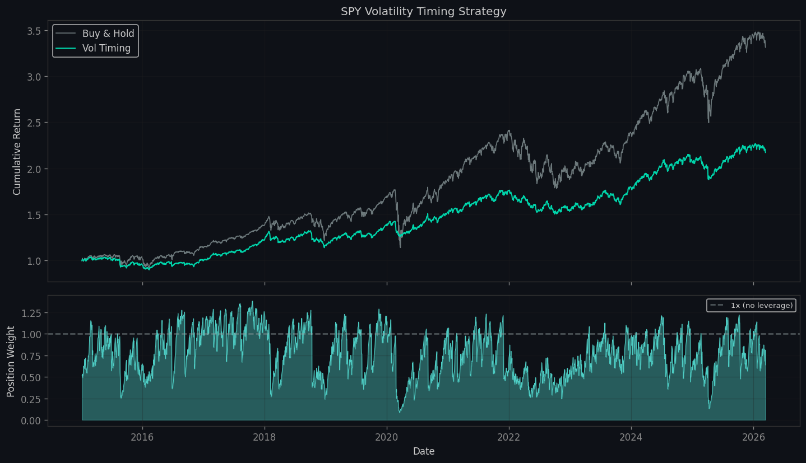
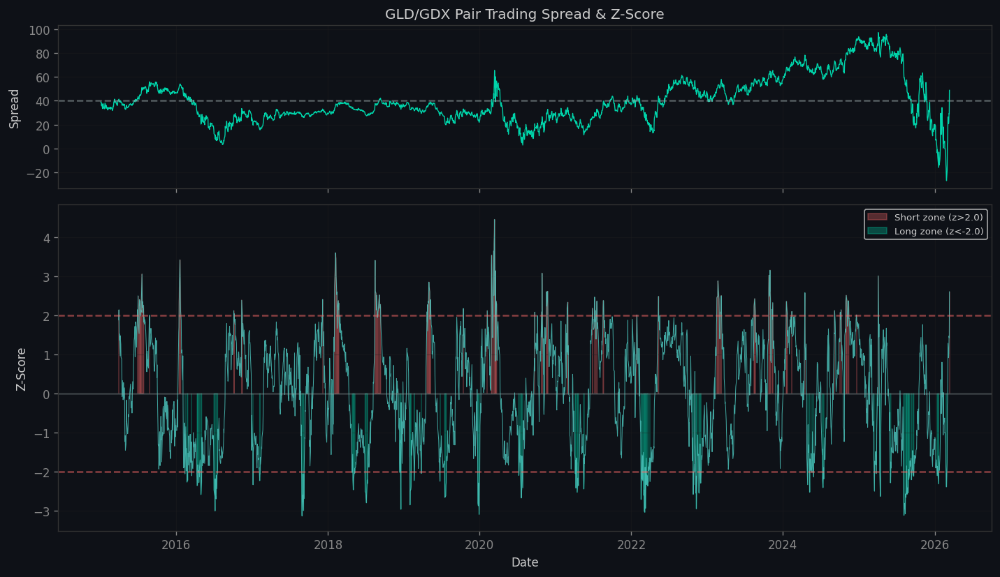
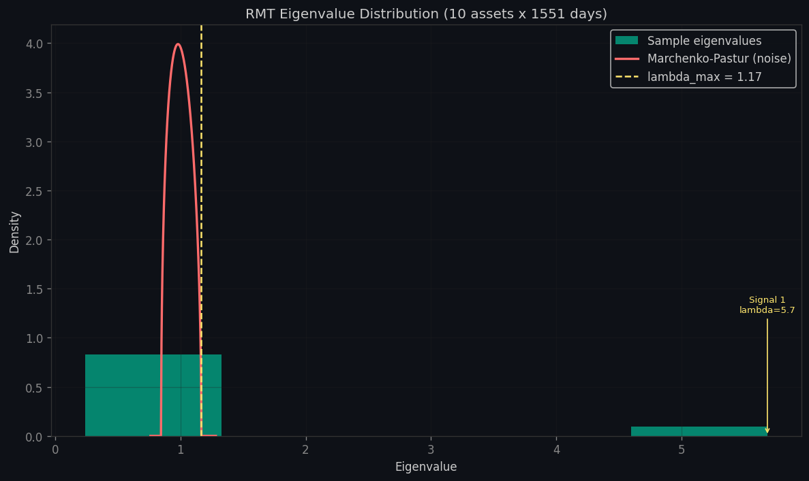
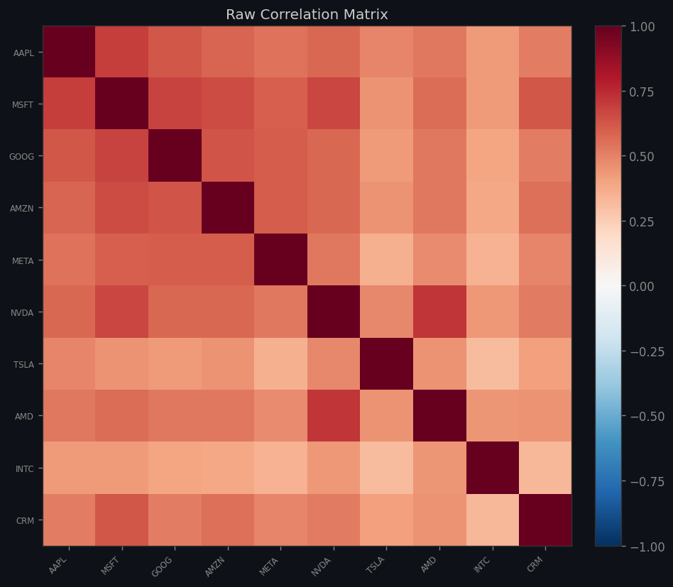
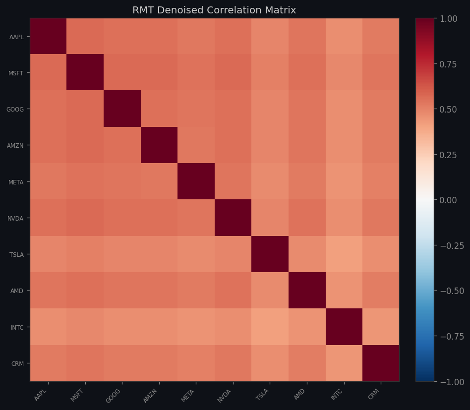

<p align="center">
  <h1 align="center">🧬 MarketDNA</h1>
  <p align="center">
    <strong>Financial Time Series Statistical Fingerprint Extractor</strong>
  </p>
  <p align="center">
    <em>Extract the hidden statistical "DNA" of any financial asset — fat tails, volatility clusters, regime shifts, and more.</em>
  </p>
</p>

<p align="center">
  
  
  
  
  
  
</p>

---

## What is MarketDNA?

MarketDNA answers the question every quant researcher asks first: **"What does this asset actually look like, statistically?"**

Instead of plotting candlestick charts and guessing, MarketDNA runs a rigorous battery of statistical tests and models to extract the **quantitative fingerprint** of any tradable asset:

| Module | What it does | Key Insight |
|--------|-------------|-------------|
| **Distribution Analysis** | Fat-tail detection, normality tests, Student-t fit | SPY has 5.1x more 3σ events than normal predicts |
| **Volatility Modeling** | GARCH(1,1), clustering detection, leverage effect | SPY vol shock half-life ≈ 21 days |
| **Pair Analysis** | Correlation, cointegration, spread dynamics | GLD/GDX: high corr (0.77) but NOT cointegrated |
| **Regime Detection** | Hidden Markov Model state identification | 2 regimes: calm (+26% ann., 136d avg) vs choppy (-37%, 40d avg) |
| **RMT Denoising** | Marchenko-Pastur noise filtering | 43% of correlation matrix is pure noise |
| **Signal Generation** | Vol timing + pair trading backtests | Vol timing: max drawdown -35.7% → -14.7% |
| **Regime+GARCH Fusion** | HMM-modulated position sizing | Proactive regime-aware vol targeting |
| **Walk-Forward Validation** | Expanding window OOS backtesting | Overfitting detection with Sharpe decay |
| **Cointegration Validator** | Rolling stability + spread stationarity | Screen pairs before deploying capital |

---

## Demo Output

### 📊 SPY Statistical Dashboard

<p align="center">
  
</p>

> Four panels: daily returns (top-left), QQ-plot vs normal showing fat tails (top-right), return distribution with normal overlay (bottom-left), rolling 20-day annualized volatility (bottom-right).

### 📉 Return Distribution — Normal vs Reality

<p align="center">
  
</p>

> The yellow Student-t(ν=2.7) curve fits the actual distribution far better than the normal (red dashed). Note the fat tails — extreme events are dramatically more frequent than Gaussian models predict.

### 🎭 Market Regime Detection (HMM)

<p align="center">
  
</p>

> Two hidden states detected: **Calm** (teal, +26% annualized, avg 136 days) and **Choppy** (gold, -37%, avg 40 days). The 2020 COVID crash, 2022 bear market, and late-2025 volatility spike are clearly captured. Regime smoothing (min 3 days) prevents unrealistic 1-day oscillations.

### ⚡ Volatility Timing Strategy (GARCH)

<p align="center">
  
</p>

> GARCH-predicted volatility drives position sizing: reduce exposure in high-vol regimes, increase in low-vol. Result: **Sharpe 0.69 → 0.74**, **max drawdown -35.7% → -14.7%**.

### 💹 Pair Trading Spread & Z-Score

<p align="center">
  
</p>

> Z-score based entry/exit signals for the GLD/GDX pair. Green shading = long spread, red = short. Entry at |z|>2, exit at |z|<0.5, stop-loss at |z|>4.

### 🔬 RMT Eigenvalue Denoising

<p align="center">
  
</p>

> Eigenvalue distribution of 10-stock correlation matrix vs Marchenko-Pastur theoretical noise bound. Only 1 eigenvalue (λ=5.68, the market factor) exceeds the noise threshold — the other 9 are indistinguishable from random noise.

<p align="center">
  
  
</p>

> **Left**: Raw sample correlation matrix. **Right**: After RMT denoising. Noise correlations are suppressed, true structure preserved. Condition number improved from 24 → 12.

---

## Quick Start

```bash
# Clone
git clone https://github.com/koriyoshi2041/MarketDNA.git
cd MarketDNA

# Setup
python3 -m venv .venv
source .venv/bin/activate
pip install -r requirements.txt

# Run full demo (generates all charts above)
python run_demo.py

# Quick scan in Python
python -c "from marketdna.scan import scan; scan('AAPL')"

# Deep scan (+ regime detection + vol timing)
python -c "from marketdna.scan import scan_deep; scan_deep('SPY')"

# Run tests
python -m pytest marketdna/tests/test_core.py -v
```

---

## Project Structure

```
MarketDNA/
├── marketdna/
│   ├── data/
│   │   └── fetcher.py              # Data layer — Yahoo Finance + return computation
│   ├── analysis/
│   │   ├── distribution.py          # Fat tails, normality tests, Student-t MLE
│   │   ├── volatility.py            # GARCH(1,1), clustering, leverage effect
│   │   ├── correlation.py           # Correlation, cointegration, spread dynamics
│   │   ├── regime.py                # HMM regime detection (2-4 states)
│   │   └── rmt.py                   # Random Matrix Theory denoising
│   ├── signals/
│   │   ├── vol_timing.py            # GARCH-based volatility targeting
│   │   ├── mean_reversion.py        # Z-score pair trading strategy
│   │   └── regime_vol_timing.py     # HMM + GARCH fusion strategy
│   ├── validation/
│   │   ├── walk_forward.py          # Walk-forward OOS backtesting
│   │   └── cointegration_validator.py # Rolling cointegration screening
│   ├── viz/
│   │   └── plots.py                 # 8 publication-quality chart types
│   ├── tests/
│   │   └── test_core.py             # 37 unit tests with synthetic data
│   └── scan.py                      # Main entry point
├── run_demo.py                      # Full demonstration script
├── output/                          # Generated charts
└── requirements.txt
```

---

## Key Features

### 🎯 Distribution Fingerprint
- **Jarque-Bera** & **Shapiro-Wilk** normality tests
- **Excess kurtosis** and **skewness** measurement
- **Student-t MLE** fitting (captures fat tails)
- **Extreme event counting** (3σ exceedances vs normal prediction)
- **QQ-Plot** visualization

### 🌊 Volatility Fingerprint
- **GARCH(1,1)** parameter estimation via MLE
- **Ljung-Box** test for volatility clustering
- **Half-life** calculation (how fast vol shocks decay)
- **Leverage effect** detection (bad news → bigger vol)
- **Vol-of-vol** and regime ratio

### 🔗 Pair Analysis
- **Return correlation** + rolling stability analysis
- **Engle-Granger cointegration** test
- **Spread half-life** estimation (AR(1) model)
- **Hedge ratio** computation via OLS
- Multi-pair scanning with multiple testing warning

### 🎭 Regime Detection
- **Gaussian HMM** with configurable number of states
- **Transition matrix** analysis
- **Auto-naming**: calm / choppy / panic / crisis (by vol)
- Per-regime return and volatility statistics

### 🔬 RMT Denoising
- **Marchenko-Pastur** noise bound calculation
- Signal vs noise eigenvalue classification
- **Eigenvalue clipping** denoising
- **Condition number** improvement tracking
- Before/after correlation matrix comparison

### ⚡ Trading Signals
- **Vol Timing**: σ_target / σ_predicted position sizing
- **Regime+GARCH Fusion**: HMM regime multiplier × GARCH vol targeting
- **Pair Trading**: Z-score entry/exit with stop-loss
- **Look-ahead bias prevention**: all signals use `shift(1)`
- Full backtest metrics: Sharpe, max drawdown, win rate

### ✅ Validation Framework
- **Walk-Forward Validation**: expanding window with quarterly OOS periods
- **Sharpe Decay Ratio**: OOS/IS Sharpe measures overfitting
- **Cointegration Validator**: rolling stability, ADF, half-life screening
- **Confidence scoring**: HIGH/MEDIUM/LOW/REJECT for pair candidates

---

## Sample Output

```
============================================================
  📊 SPY 分布指纹  (2809 个交易日)
============================================================
  年化收益率:  +12.3%
  年化波动率:  17.8%
  偏度:        -0.581  ← 左偏（跌得更猛）
  超额峰度:    14.58   ← 极度厚尾

  🔬 正态性检验:
     Jarque-Bera p值: 0.00e+00  ❌ 拒绝正态

  ⚡ 极端事件:
     超过3σ的天数:    39 天 (1.39%)
     正态预测:        0.27% → 实际是5.1倍

  📐 Student-t 拟合:
     自由度 ν = 2.7  ← 尾巴很厚（<5）
============================================================
```

---

## Tech Stack

| Library | Purpose |
|---------|---------|
| **numpy / pandas** | Numerical computation & time series |
| **scipy.stats** | Statistical tests & distribution fitting |
| **statsmodels** | Econometric tests (Ljung-Box, ADF, cointegration) |
| **arch** | GARCH volatility modeling |
| **hmmlearn** | Hidden Markov Model regime detection |
| **matplotlib** | Publication-quality visualization |
| **yfinance** | Market data acquisition |

---

## Testing

All 37 tests use **synthetic data** (no network dependency) to verify statistical correctness:

```
$ python -m pytest marketdna/tests/test_core.py -v

TestDistribution::test_fingerprint_shape        PASSED
TestDistribution::test_rejects_normal           PASSED
TestDistribution::test_normal_data_accepted     PASSED
TestDistribution::test_student_t_fit            PASSED
TestDistribution::test_tail_analysis            PASSED
TestVolatility::test_fingerprint_fields         PASSED
TestVolatility::test_garch_persistence          PASSED
TestVolatility::test_clustering_detection       PASSED
TestCorrelation::test_pair_fingerprint          PASSED
TestCorrelation::test_cointegration_detected    PASSED
TestCorrelation::test_non_cointegrated          PASSED
TestRegime::test_regime_detection               PASSED
TestRegime::test_three_regimes                  PASSED
TestRegime::test_regime_labels_aligned          PASSED
TestRegime::test_smoothing_removes_short_segments PASSED
TestRMT::test_rmt_basic                         PASSED
TestRMT::test_denoised_condition_improves       PASSED
TestRMT::test_mp_bounds                         PASSED
TestVolTiming::test_vol_timing_signal           PASSED
TestVolTiming::test_leverage_cap                PASSED
TestVolTiming::test_vol_reduction               PASSED
TestMeanReversion::test_pair_trading_signal     PASSED
TestMeanReversion::test_positions_bounded       PASSED
TestMeanReversion::test_hedge_ratio_reasonable  PASSED
TestViz::test_plot_qq_no_crash                  PASSED
TestViz::test_plot_distribution_no_crash        PASSED
TestViz::test_plot_dashboard_no_crash           PASSED
TestRegimeVolTiming::test_regime_vol_timing_signal  PASSED
TestRegimeVolTiming::test_regime_modulation_differs PASSED
TestRegimeVolTiming::test_leverage_cap_regime   PASSED
TestCointegrationValidator::test_cointegrated_pair_passes PASSED
TestCointegrationValidator::test_independent_pair_rejected PASSED
TestCointegrationValidator::test_report_fields  PASSED
TestWalkForward::test_walk_forward_vol_timing   PASSED
TestWalkForward::test_walk_forward_pair_trading PASSED
TestWalkForward::test_insufficient_data_returns_empty PASSED
TestWalkForward::test_sharpe_decay_ratio        PASSED

======================== 37 passed in 5.42s =========================
```

---

## Learning Resources

This project comes with a comprehensive **bottom-up learning guide** (in Chinese):

📖 [**量化研究员学习路线 — MarketDNA实战指南**](量化研究员学习路线_MarketDNA实战指南.md)

Covers 10 layers of knowledge from data basics → distribution theory → GARCH → cointegration → HMM → RMT → signal construction → backtesting → engineering practices. Every concept links back to specific code in this project.

---

## License

MIT

---

<p align="center">
  <sub>Built for learning quantitative research. Not financial advice.</sub>
</p>
